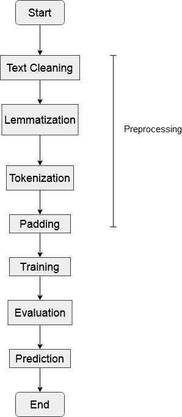
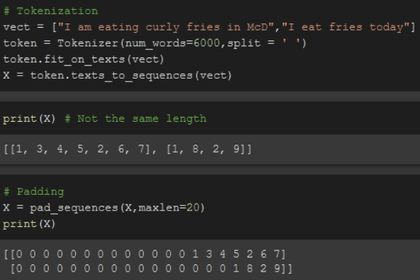
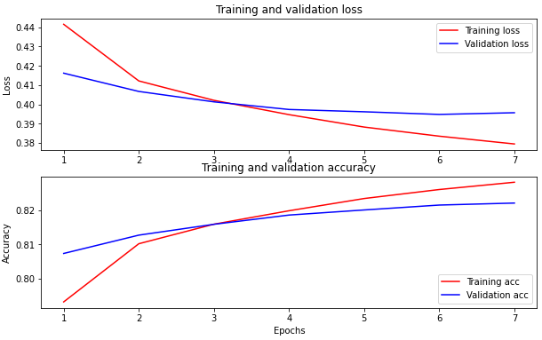
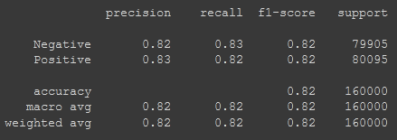

# NLP Pipeline

1. Text cleaning
    1. Convert all characters to lower cases
    2. Remove punctuations
    3. Remove symbols & carriage return
    4. Remove numbers
    5. Remove URL
2. Lemmatization
3. Tokenization
4. Padding
5. Training (A simple Long Short-Term Memory network will be used in this example)
6. Evaluation
7. Prediction

 

 
 

# Pre-processing
### Why Lemmatization

Instead of simply cutting off the end or the beginning of a given word like Stemming does, Lemmatization takes care of the morphological analysis of the given word, meaning that it makes sure that the produced word is a dictionary word. 

 

### Why Padding

To make sure all the input sentences eventually have the same length when they're being fed into the model.

 

### Why the pickled tokenizer is needed while loading the saved model

During the training of the model, `fit_on_texts()` was utilized to update the internal vocabulary. 
When loading the trained model elsewhere, things will be messed up without loading the pickled tokenizer and the model will not work as expected. 
  
In other words, `fit_on_texts()` is like giving an 'identity' to each word (e.g. 1, 2, 3, 4 ...... while 0 is reserved for padding). If the model initially recognizes 1 as *happy* (training phase) , how could you expect it to recognize 20 as *happy* later (with new tokenizer) ?    
For evidence, please refer to `Experiement.ipynb`. 

 
 

# NLTK stopwords removal

Removing stopwords, which is common words such as *'a, an, no, not ......'* , is a necessary pre-processing step. However, I ran an experiment without using NLTK stopwords removal and it shows an improvement in terms of accuracy.  

 

The reason is that, NLTK stopwords removal removes some useful words from the input text. For instance, the input text *'I do not like durian'* will become *'I like durian'* after applying the NLTK stopwords removal.   

# Conclusion

For improvement, a personal stopwords list may be constructed. Common words like *'she, he, i'* will be included in the list whereas words like *'no, not'* will be excluded because these words carry certain meaning which shouldn't be discarded from the input text.
